# Oaks Taverners Cricket Club

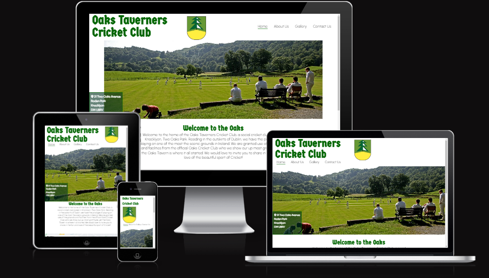

Oaks Taverners Cricket Club is a fictitious social cricket club based in the outskirts of Dublin in Knocklyon, which is also an extension to an official cricket club which is called Oaks Taverners Cricket Club. The purpose of the club is to play the game of cricket at a non cometitive way in a much shorter time frame than regular cricket matches which invites anyone from experienced veterans to first time players alike to join in the fun of playing cricket. Taverners Cricket in real life is an existing non competitive league in Dublin and beyond.

The purpose of this website is to introduce and promote the Taverners cricket club to anyone interested in joining. It gives all the information anyone needs to know about the club and how it (and Taverners Cricket) functions. The main purpose is to ease people into the club without blasting them with too much information but expressing the simplicity and fun of it all. Once a member desides to join, they will obviously be invited to a whatsapp group and email feed which will give them all the precise information needed on playing and other events.

Visit the deployed website [here](https://serjosh.github.io/oaks-taverners-cricket-club/)

## Table of Contents

1. [User Experience (UX)](#user-experience-ux)
   1. [Project Goals](#project-goals)
   2. [User Stories](#user-stories)
   3. [Typography](#typography)
   4. [Color Scheme](#color-scheme)
   5. [Wireframes](#wireframes)
2. [Features](#features)
   1. [General](#general)
   2. [Home](#home)
   3. [About Us](#about-us)
   4. [Gallery](#gallery)
   5. [Contact Us](#contact-us)
3. [Technologies Used](#technologies-used)
   1. [Languages Used](#languages-used)
   2. [Frameworks, Libraries and Programs Used](#frameworks-libraries-and-programs-used)
4. [Testing](#testing)
   1. [Testing User Stories](#testing-user-stories)
   2. [Code Validation](#code-validation)
   3. [Accessibility](#accessibility)
   4. [Tools Testing](#tools-testing)
   5. [Manual Testing](#manual-testing)
5. [Finished Product](#finished-product)

---

## User Experience (UX)

### Project Goals

- The website has a simple yet expressive design, clean and clear to find and see what you want, not too demaning on new members eyes.

- Provide potential members the location and contact details of the club

- Present Information needed to know about the club, about the cricket and a simple explainintion how to play cricket.

- Present a display of Images of a cricketing nature as well as the fun and social aspects of the club.

- Offer an option to contact the club with any messages or questions potential members would like to say.

### User Stories

- As a potential member I would like the website to be informative enough for me to be interested.

* As a potential member I would like to not be overloaded with information when looking up the dtails about the club

* As a potential member I would like to see the play in action and see its social interation without being intimidated by any competitivity.

* As a potential member I woul like to see that I will be welcome, no matter what my cricketing background is.

* As a potential member I would like to see the location of the club.

* As a potential member I would like a space where I can contact someone about any queries I have about the club.

### Typography

I used two fonts in this website, which consists of Germania One for the headings and Urbanist for the paragraphs. San Serif was used as a fallback for both headings and paragraphs. I chose the combonations myself. Germania One for the medieval vibe I thought suited well with the term Oaks, Cricket and the Scenic Images I have used, and Urbanist for the clarity and simplicity to make the content readable and easy on the eye.

### Color Schemes

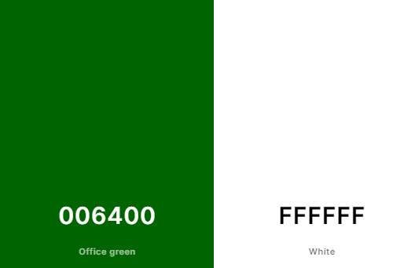

The colors I have used are very simple. I have used Dark Green (#006400) to stand out from the other color of white, but mostly to represent the scenic grounds Ireland has to offer aswell as the color of greenery represented on cricket feilds. And the simple color of White (#FFFFFF) which is what cricketers clothes colors are, its simple enough, as the page naturally comes in white, and so do the clothes!

### Wireframes

[Balsamiq](https://balsamiq.com/) has been used to mockup the website and display the placement of the different elements whitin the pages. Obviously, there is now a difference from the mockup to the finished website as new inspirations occurred to me whilst working on the project, the most notable would be adding the Gallery as a seperate page and moving the map in the contact us page to the bottom.

index.html 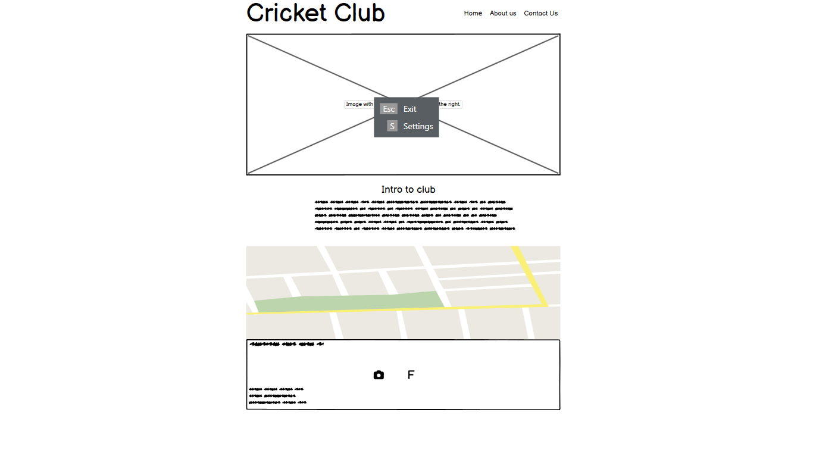
about-us.html 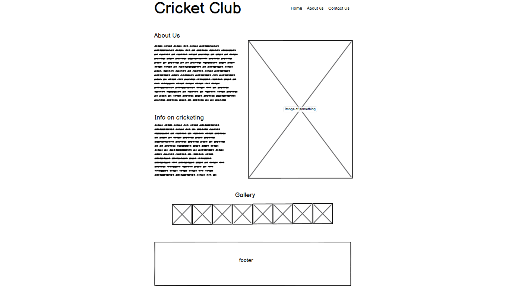
contact-us.html 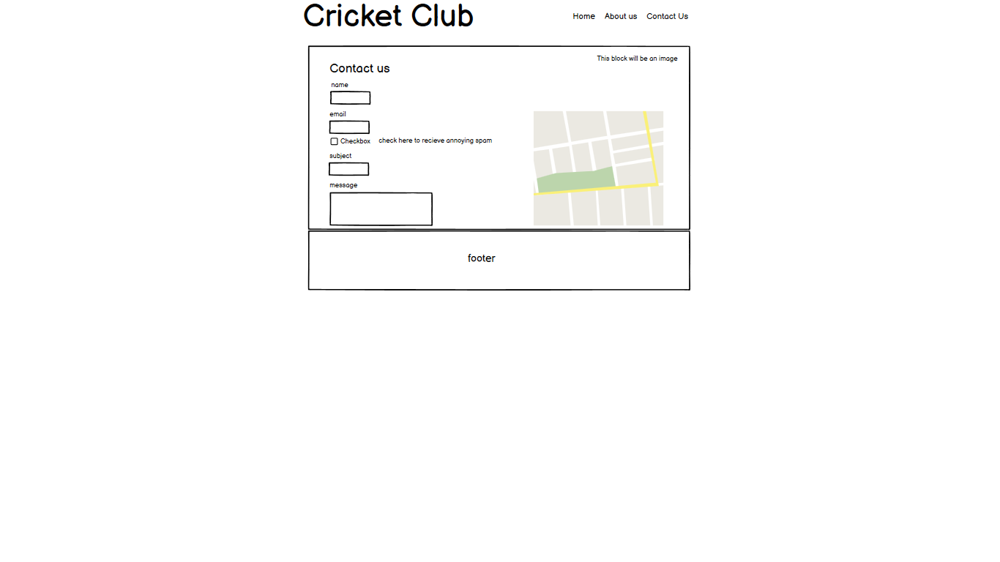

## Features

### General

- Responsive design across all device sizes (up to 350px).

- Similar color scheme and design throughout all pages to keep consistency.

* **Header**
  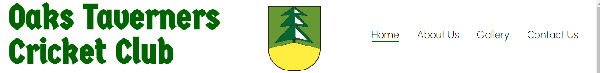

The Header contains The Club Logo (name). The navagation bar, which facilitates navagation around the website and also has a hover effect to help know what page you are on. And the Sigil in the center, representing the Club as a whole, including the official cricket club. All is responsive.

- **Footer**
  

The footer is simple enough across all pages, sporting the color of darkgreen, used across all pages with links to facebook and instagram. All is responsive.

### Home

- **Hero Image**
  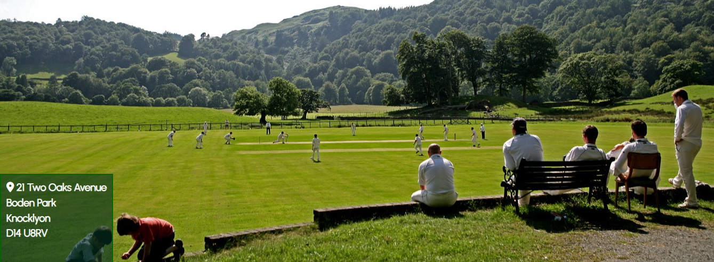

The Hero Image is used to attract the potential member to the landscape of cricket, which can be very beautiful, with the image also hosting standbyers. The hero image also has an address block on the bottom right, to imediately state the location of the cricket club before the viewer can move on. All is responsive.

- **Welcome to the Oaks Section**
  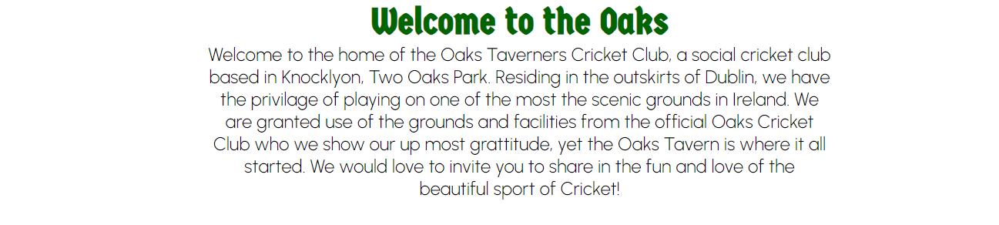

An introductory statement of the club, mostly of its welcome message and location. All is responsive.

- **Map**
  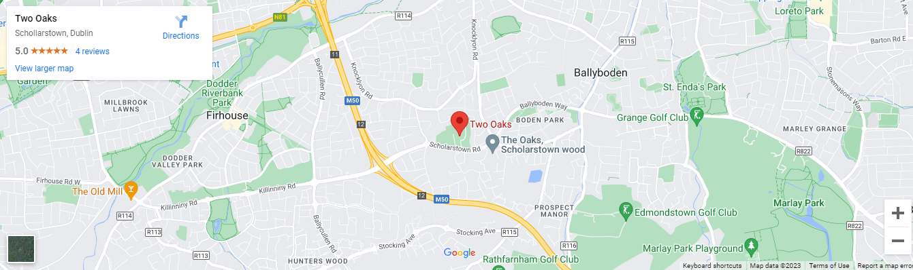

A Google map, stating the location of the area and the streets and districts around it. Useful when wanting to know google map directions if in need to know travelling perameters. All is responsive.

### About Us

- **About Us**
  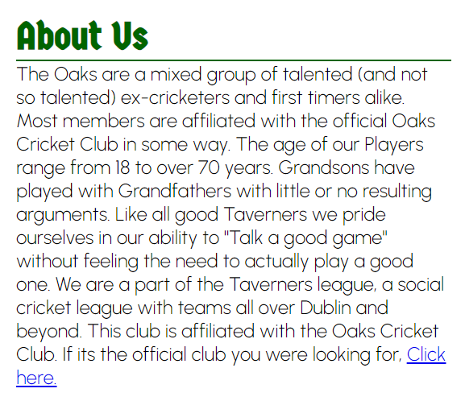

A section of heading and text giving you the general information about the club, it also has a link to the official Oaks Cricket Club if diesired to go there. All is responsive.

- **Cricketing Info**
  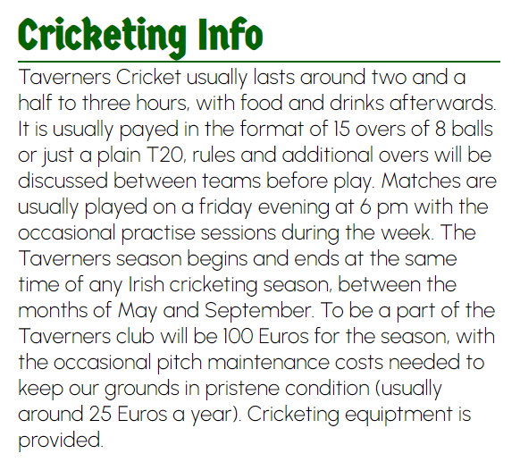

This section provides you with all the information about the cricket, from when they play, how long they play and how much it is to play. It gets to the point in a brief summary which is an easy read which implements the simplicity of the website. All is responsive.

- **How to Play**
  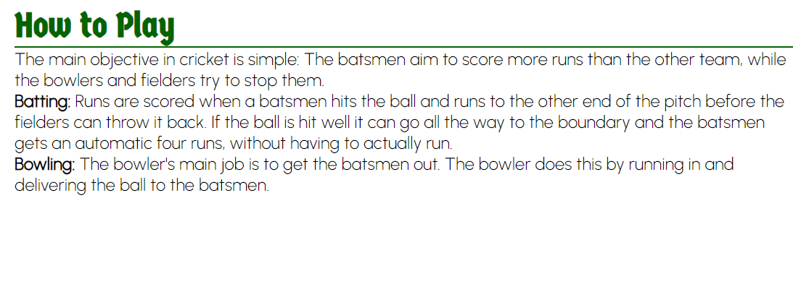

A simple explaination on how to play cricket. All is responsive.

- **About Us image**
  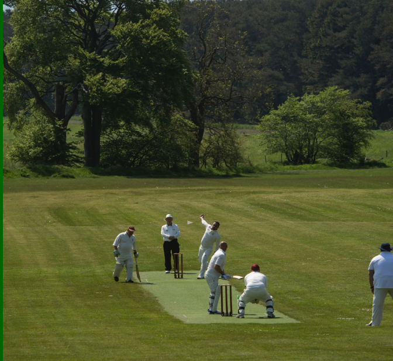

A large Cricket image, re-enforcing the dark green scheme implemented on the page. All is responsive.

### Gallery

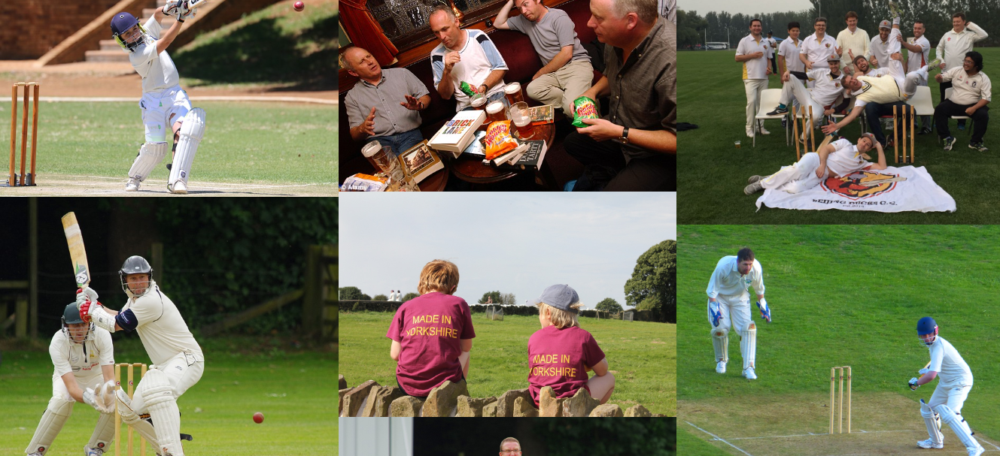
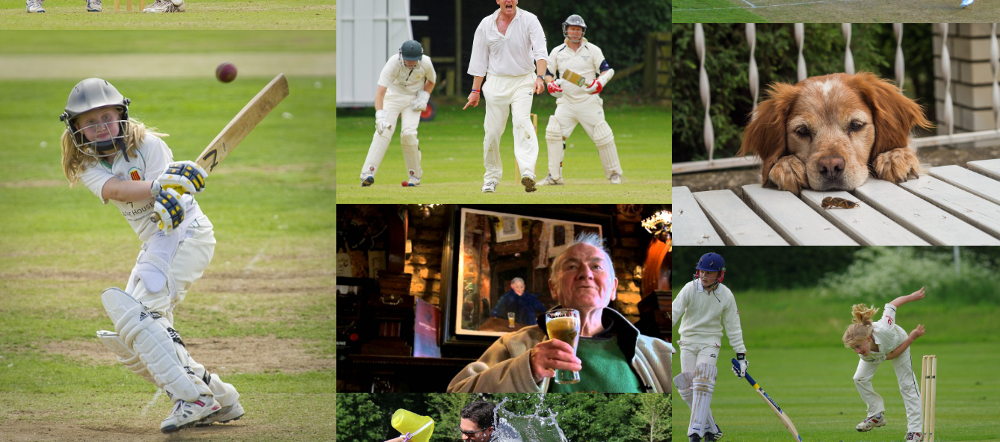

A vast array of images of the club, from its social aspects, its cricket and of course the Tavern which is all mixed together expressing a form of equal importance between cricket and the social aspects. All is responsive.

### Contact Us

- **Contact Us Form**

  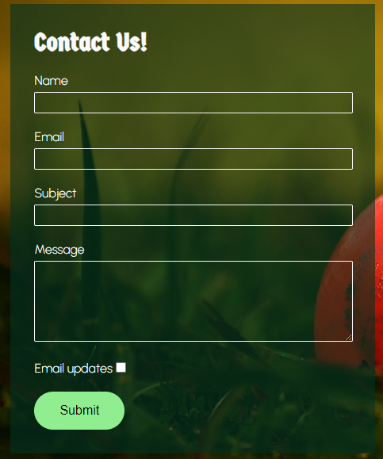

A form that can be filled in about any queries you would like to know about the club, from signing up to just a question. It has a text option for your email, your name, your subject and your message, you can also request email updates in the checkbox. Light Green is used in the form when hovered over certain elements, to differenciate from the dakgreen transparent box. All is responsive.

- **Address and Contact**

  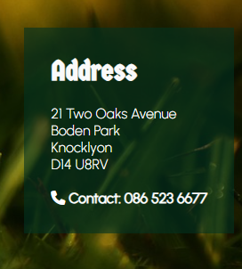

The address again but with a contact number if you would like to call, it is included at the end again to remind the viewer of its location. All is responsive.

- **Map**
  

The Map again, to remind the viewer of its location. All is responsive.

## Technologies Used

### Languages Used

- [HTML5](https://en.wikipedia.org/wiki/HTML5)
- [CSS3](https://en.wikipedia.org/wiki/CSS)

### Frameworks, Libraries and Programs Used

- [Google Fonts](https://fonts.google.com/)

  Google Fonts was used to import the fonts Germania One, Urbanist and San Serif into the style.css file. These fonts were used throughout the site.

- [Font Awesome](https://fontawesome.com/)

  Font Awesome was used in the footer, location on the first page (Home) and a phone on the contact number on the last page(Contact Us) visual experience for UX purposes.

* [Balsamiq](https://balsamiq.com/)

  Balsamiq was used to create the wireframes during the planning phase of the project.

* [TinyPNG](https://tinypng.com/)

TinyPNG was used to reduce the file size of the images for the website.

- [Chrome DevTools](https://developer.chrome.com/docs/devtools/)

  Chrome DevTools was used during development process to test responsiveness.

- [Codeanywhere](https://app.codeanywhere.com/)

  Codeanywhere was used for writing code, committing, and then pushing to GitHub.

- [GitHub](https://github.com/)

  GitHub was used to store the project after pushing.

- [W3C Markup Validator](https://validator.w3.org/)

  W3C Markup Validator was used to validate the HTML code.

- [W3C CSS Validator](https://jigsaw.w3.org/css-validator/)

  W3C CSS Validator was used to validate the CSS code.

## Testing

### Testing User Stories

- As a Viewer, I want to be able to navigate the website intuitively and learn more about the club.

  - The website offers an intuitive structure for the viewers to navigate and find the information they are looking for.

  - The navigation bar is clearly presented in all pages for the viewer to find with ease and it is easily navigable.

* As a viewer, I want to be able to see the club in action, see a bit of a human element.

  - The Gallery page presents multiple images containing the club playing cricket and socialising, which is all in the Gallery.

  - There are a few background images containing cricket elements, with the Home page containing a landscape image of the Clubs ground.

* As a viewer, I want to easily find the contact information for the club.

  - The Contact Us page contains a clear contact section, with an option to message the club about any queries concerning the club as well as an address and contact number, with the address also viewed on the Home page.

* As a viewer, I want to find social media links to the club.

  - The footer provides link to the club's social media channels on all pages.

* As a viewer, I want to easily find the Club's location.

  - On the Home page as well as the Contact Us page you will be able to find a map showing the club's geographical location.

* As a viewer, I want to know a little more about the cricket and also if new to the game, how to play

  - On the About Us page, you will find all the cricketing details on how the club plays, also a brief and simple explaination on how the game is played.

### Code Validation

The [W3C Markup Validator](https://validator.w3.org/) and [W3C CSS Validator](https://jigsaw.w3.org/css-validator/) services were used to validate all pages of the project in order to ensure there were no syntax errors.

#### W3C Markup Validator

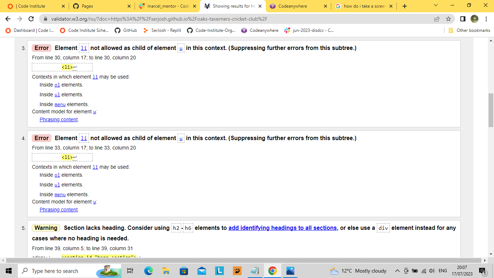
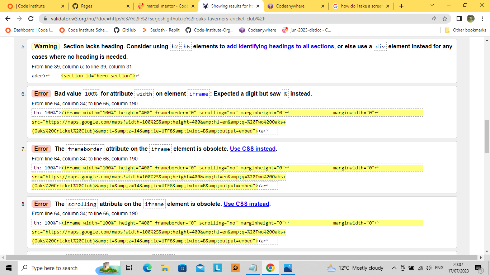

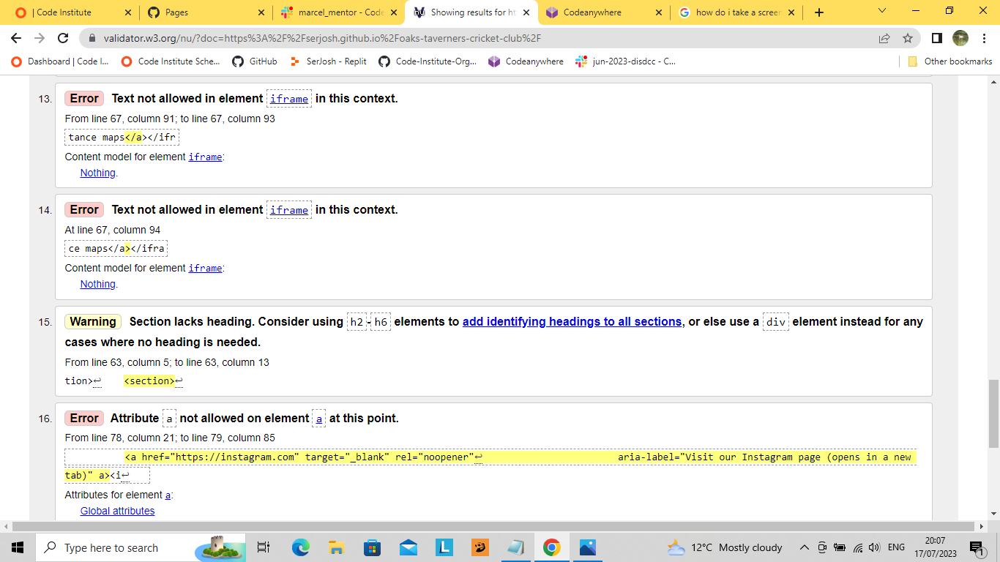

There were originally a few errors in my W3C Markup Validator test, this is how I fixed them.

- I forgot to add an l to the ul element for the navagation code, for all pages, therefore I added the l to the u making it ul, I then wrote a CSS for the ul code to make sure the navagation menu stays in its place. This fixed the first 4 errors.

- The next few errors had to do with the map which I developed using Google Maps iframe Generator, I removed the width, frameborder, scrolling, margin-height and margin-width from the html code as it is obsolete. Then I added CSS code for the Map to do what I needed it to do. I also removed the a href text from the map code as it was obsolete too.

- There was also a rouge a implemented in the social links by accident, so I removed it.

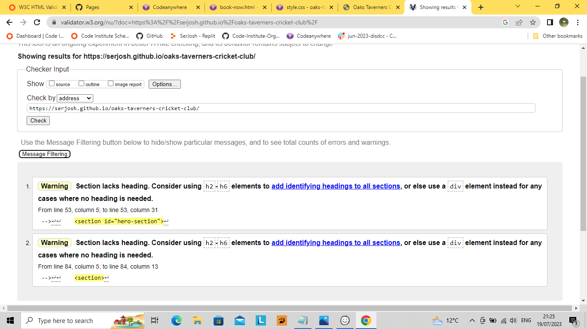

So I am left with 2 warnings where its warning me that the sections lack headings, however the sections do not need the use of headings in this case.

#### W3C CSS Validator

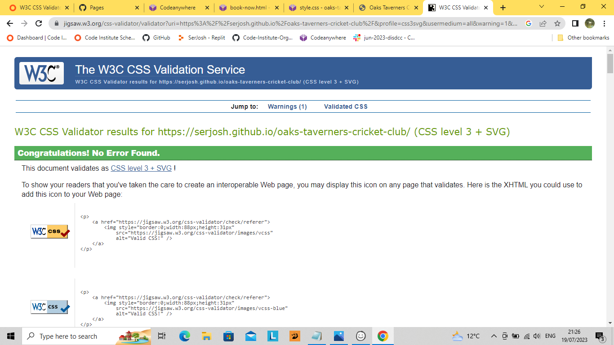

No errors were found in the W3C CSS Validator test.

### Accessibility

- Used Lighthouse in Chrome DevTools to confirm that the colors and fonts being used in throughout the website are easy to read and accessible.

- Lighthouse reports

  - **Home Page**

  

  - **About Us Page**

  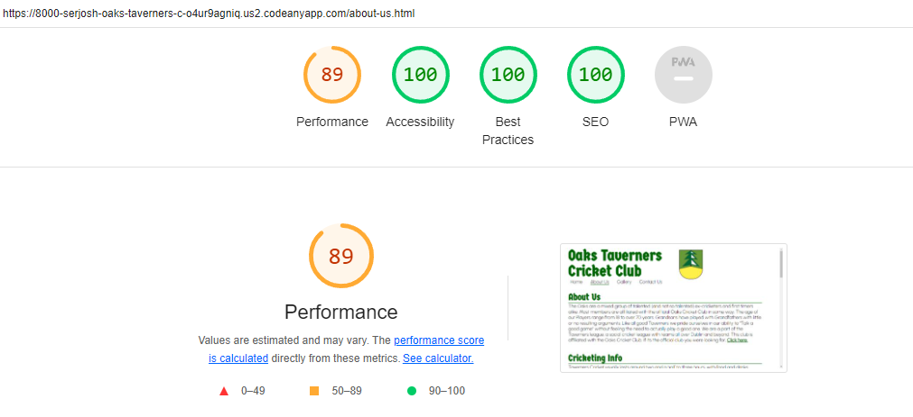

  - **Gallery Page**

  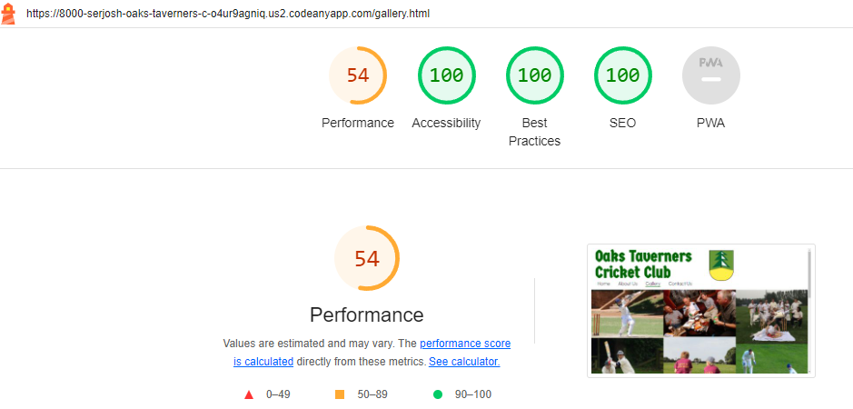

  - **Contact Us Page**

  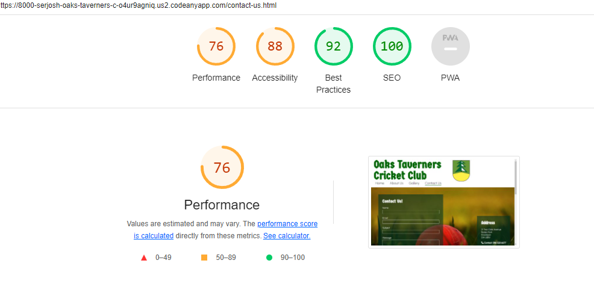

  ### Tools Testing

* [Chrome DevTools](https://developer.chrome.com/docs/devtools/)

  - Chrome DevTools was used during the development process to test, explore and modify CSS styles used in the project, and also to test responsiveness.

  - [Am I Responsive?](http://ami.responsivedesign.is/#) was used to check responsiveness of the site pages across different devices.

  - [Responsive Design Checker](https://www.responsivedesignchecker.com/) was used to check responsiveness of the site pages on different screen sizes.

  ### Manual Testing

* Browser Compatibility

The website has been tested on the following browsers:

- **Goolgle Chrome**

  No pearance, responsiveness nor functionality issues.

- **Mozilla Firefox**

  No appeance, responsiveness nor functionality issues.

* Device compatibility

The website has been tested on multiple devices, including:

- **10" Notebook**

No appearance, responsiveness nor functionality issues.

- **Apple iPad Pro**

No appearance, responsiveness nor functionality issues.

- **Nexus 9**

No appearance, responsiveness nor functionality issues.

- **Apple iPad Mini**

No appearance, responsiveness nor functionality issues.

- **Apple iPhone 6s Plus/ 7 Plus**

No appearance, responsiveness nor functionality issues.

- **Samsung Galaxy S5/S6/S7**

No appearance, responsiveness nor functionality issues.

- Common Elements Testing

- All Pages

  - **Navigation Bar**

          - Hovering on the different navigation bar's links will trigger hover effect, underlining the link for the viewer in dark green.

          - Clicking on the navigation bar's links will bring the customer to the specified page.

  - **Footer**

          - Clicking on the social media links will open that specific website on a new tab.

  - **Map**

          - Not necessarily across all pages but two of them (Home page and Contact Us page)

          - clicking and holding on the map, you will be able to move around the map to see other locations around it.
          - Press the plus/minus buttons to scroll and see more geography of the map and vice verse.

          - You can also click on other locations to bring up basic details at the top right of the map.

- Contact Us Page

  - When filling out the contact us form, all fields are mandatory when clicking on the submit button.

  - A text input field for your name (required)

  - A text input field for your email (required)

  - A text input field for your subject (required)

  - A text input field for your message (required). Text field has been enlarged for potentially more text.

  - A check box for email updates, when clicked a tick will appear (not required)

  - When hovering over any of the text input blocks, the color will change to light green.

  - When hovering over the submit button, the color will change to white, with the writing to dark green.

  - When clicking on the submit button after filling in all the fields, the information will be sent to oakstavern@gmail.com, which does not exist therefor sending you to an error page.

## Finished Product

## Deployment

- This website was developed using [Codeanywhere](https://app.codeanywhere.com/), which was then committed and pushed to GitHub using the codeanywhere terminal.

### GitHub Pages

- Here are the steps to deploy this website to GitHub Pages from its GitHub repository:

  1. Log in to GitHub and locate the [GitHub Repository](https://github.com/).

  2. At the top of the Repository, locate the Settings button on the menu.

  3. Scroll down the Settings page until you locate the Pages section on the left of the screen.

  4. Under Branch, click on select branch and from the dropdown list choose main.

  5. The page will refresh automatically and generate a link to the website.

  ## Credits
